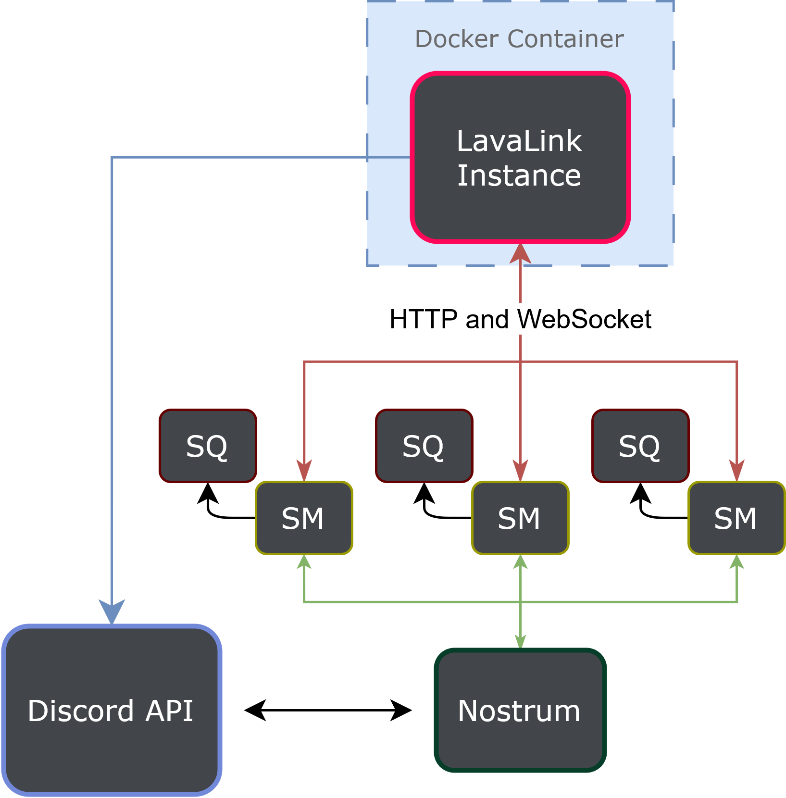

# ElNino

Discord music player bot. Powered by Elixir with Nostrum.

A bot is capable of working on multiple servers at once. Unstable feature.

## Dependencies

- [Nostrum](https://github.com/Kraigie/nostrum) - Discord API wrapper
- [WebSockex](https://github.com/dominicletz/websockex) - WebSockets handling
- [Req](https://github.com/wojtekmach/req) - HTTP requests handling
- [Qex](https://github.com/princemaple/elixir-queue) - Erlang's `:queue` wrapper

### LavaLink

The bot delegates music playback to a separate [LavaLink](https://github.com/lavalink-devs/Lavalink) instance, created via [Docker Compose](lavalink/).

## Architecture

  Currently the architecture consists of the main Nostrum Bot process communicating with the Discord API. Relevant commands create (if not present) a pair of Song Manager (SM) and Song Queue (SQ) processes connected to the context Guild (server). A separate LavaLink instance is always active in a separate docker container. Each SM oversees its own LavaLink [Player](https://lavalink.dev/api/rest.html#player-api) within a single [Session](https://lavalink.dev/api/rest.html#update-session). LavaLink intercepts incoming VC connections and independently manages them. SM modifies and ultimately deletes a Player when needed.

<!--  -->